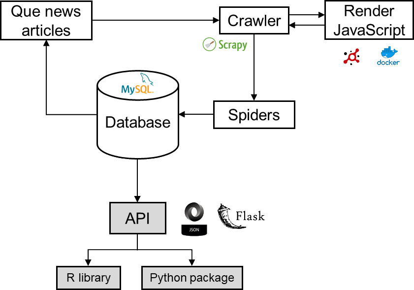

# Mechanical News

Mechanical News is an application framework that scrapes and saves the full text of online news articles to a database for social science research.

Mechanical News it built on top of [Scrapy](https://scrapy.org/) and [Flask](http://flask.pocoo.org/) and provides a high-level API to scrape and expose articles. Scrapy helps you write web scrapers that scrape news articles, which is then stored in a database. Flask then helps by exposing the articles through a RESTful API where you can easily retrieve them.

The users (i.e., researchers) use an R library or Python package to retrieve the articles in a [tidy data](https://en.wikipedia.org/wiki/Tidy_data) format directly from the API.  You run Mechanical News on your own server. The users does not need to know anything about Mechanical News, other than the package itself.

## Features

- Extract information from news articles using an existing scraper (or build your own)
- Store full text news articles to a database
- Run in different modes:
   - Scrape articles from news sites continuously (e.g., every day)
   - Scrape articles from specific URLs
- Expose articles via API, making them available for students or collaborators with an API key

## Extracted information from news articles

News content

- headline
- article lead
- article body text
- links in article body text
- main image

Metadata

- authors
- date of publication
- date of modification
- news section (e.g., World, Sports, Tech)
- tags
- categories
- language
- type of page (e.g., text article, video, sound)
- news genre (e.g., news, sports, opinion, entertainment)
- whether the article is behind a paywall
- HTTP response headers
- metadata tags (e.g., OpenGraph, microformats)
- when the article was present on the frontpage

## Overview of the architecture



## Install

*Not yet available*

<!--

Install the Mechanical News server application:
```
$ pip install git+https://github.com/peterdalle/mechanicalnews.git@release
```
-->

Requirements:

- Python 3.6+
- MySQL 5.6+
- Docker

Mechanical News have been tested on Windows 10, Red Hat 7.6, and Ubuntu 18.

## Quick start

Scrape all news articles from the news frontpages using all available spiders in the [`spiders` directory](mechanicalnews/spiders/README.md) by running this from the project path:

```bash 
$ python run.py --crawl
```

Scrape all news articles from the frontpage of a specific site (`aftonbladet` is the name of the spider):

```bash 
$ python run.py --crawl aftonbladet
```

Scrape the news article content from a specific URL:

```bash 
$ python run.py --url https://www.aftonbladet.se/kultur/a/BRoWvQ/sa-kan-putin-bli-kvar-vid-makten
```

## Available spiders

Show all spiders you have installed:

```bash
$ python run.py --list
```

This will list all spiders in your [`spiders` directory](mechanicalnews/spiders/README.md). A spider is responsible for scraping a news site.

## Documentation

See [documentation wiki](https://github.com/peterdalle/mechanicalnews/wiki).

## Contribute

Read [how to contribute to Mechanical News](CONTRIBUTE.md) by writing your own scrapers and share them.

## Support

- Report issues or problems by [submitting a new issue](https://github.com/peterdalle/mechanicalnews/issues/new)
- Read how to [get further support](SUPPORT.md)

## License

[GNU General Public License v3.0](LICENSE)

## Similar projects

- [newspaper](https://github.com/codelucas/newspaper) - library for automatic news article metadata extraction using heuristics. Mainly useful for English speaking content and when you don't want specific metadata.
- [news-please](https://github.com/fhamborg/news-please) - library and system for news article metadata extraction with database and search function, also built on Scrapy and newspaper. However, you cannot specify what information you want to extract.
- [Media Cloud](https://github.com/berkmancenter/mediacloud) - open data platform that allows researchers to answer quantitative questions about the content of online media. Roll your own server or use the cloud service. However, you cannot access full text due to copyright.
