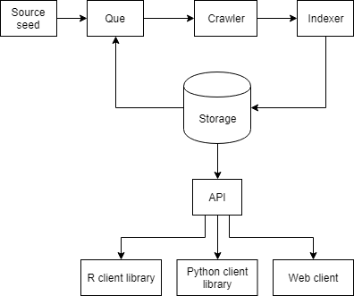
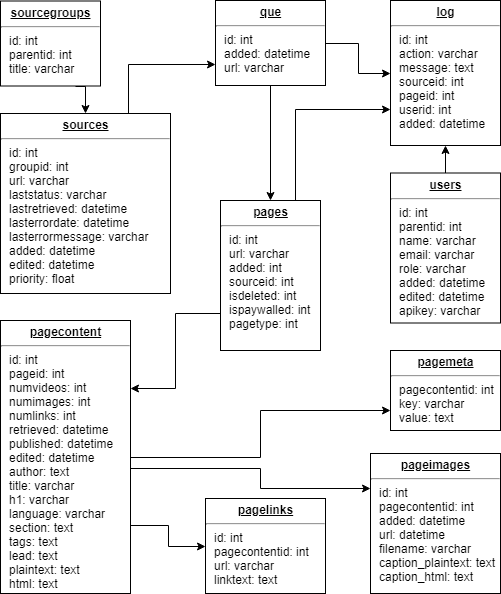

# Mechanical News

Mechanical News is a Python web server application that crawls and saves news articles for research purpose.

- Automatically download and extract information from news articles
- Save structured information into a searchable database
- Get structured news data through an API client library
- Extend with your own news sources and collect custom information

Researchers can use Mechanical News with a client library of their favorite programming language, and thereby minimize the distance from data collection to both data analysis and machine learning.

An R client library for the Mechanical News API is being developed. An equivalent for Python is planned as well.

This project is under development at the [Department of Journalism, Media and Communication (JMG), University of Gothenburg](https://jmg.gu.se/english). Specifications may change.

## Application architecture

The design approach is [API first](https://medium.com/adobetech/three-principles-of-api-first-design-fa6666d9f694), and Mechanical News expose a RESTful API.

Mechanical News backend depends on:

- Python 3+ running nginx on Ubuntu
- Crawler [Scrapy](https://github.com/scrapy/scrapy) with [Scrapy-Splash](https://github.com/scrapy-plugins/scrapy-splash)
- Indexer [newspaker3k](https://github.com/codelucas/newspaper)
- Database MySQL/MariaDB

## Database architecture

## Todo

- [x] Application design
- [ ] Build scraper with headless browser that access HTML DOM
- [ ] Build one scraper per news site
- [ ] Build scheduler and que system
- [ ] Add user handling with API keys
- [ ] Add automatic error handling, with e-mail alerts
- [ ] Run unit tests
- [ ] Build R client library
- [ ] Validate method against existing data sources
- [ ] Build Python client library
- [ ] Build web client

## History

- 2019-02-08 Design implementation.
- 2018-10-22 Design idea started.

## License

[GNU General Public License v3.0](LICENSE)